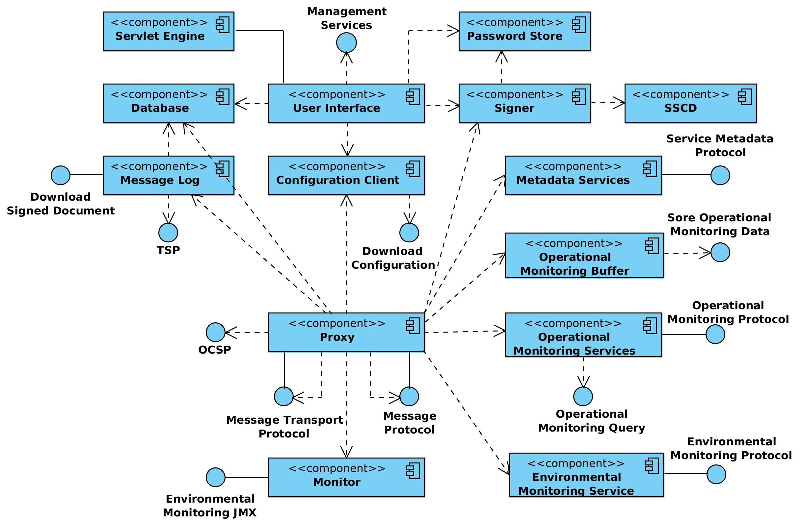
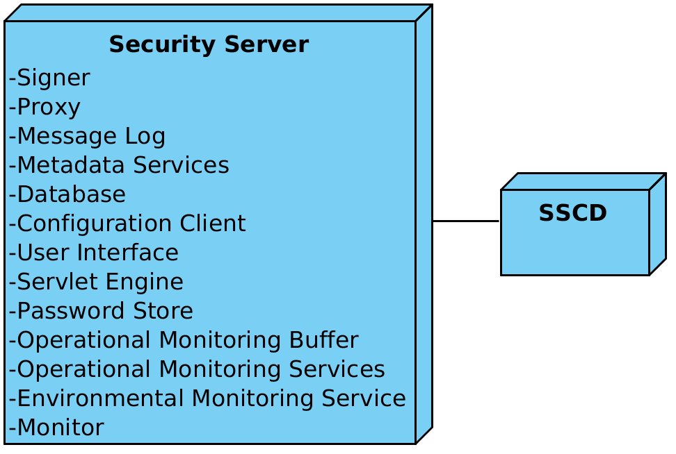

---

# X-Road: Security Server Architecture
**Technical Specification**

Version: 1.4
20.02.2017
<!-- 15 pages -->
Doc. ID: ARC-SS

---

## Version history

 Date       | Version | Description                                                 | Author
 ---------- | ------- | ----------------------------------------------------------- | --------------------
 09.07.2015 | 0.1     | Initial version                                             | Ilja Kromonov
 08.09.2015 | 0.2     | Rearranged references, made some editorial changes          | Margus Freudenthal
 09.09.2015 | 0.3     | Editorial changes, simplified deployment, technology matrix | Margus Freudenthal
 15.09.2015 | 0.4     | Audit log                                                   | Kristo Heero
 15.09.2015 | 0.5     | Message log updated                                         | Kristo Heero
 16.09.2015 | 0.6     | Incorporated feedback from Vitali                           | Margus Freudenthal
 17.09.2015 | 1.0     | Editorial changes made                                      | Imbi Nõgisto
 21.10.2015 | 1.1     | SSCD and password store related information added           | Ilja Kromonov
 16.12.2015 | 1.2     | Incorporated environmental monitoring                       | Ilkka Seppälä
 19.12.2016 | 1.3     | Added operational monitoring                                | Kristo Heero
 20.02.2017 | 1.4     | Converted to Github flavoured Markdown, added license text, adjusted tables for better output in PDF | Toomas Mölder

## Table of Contents

<!-- toc -->

- [License](#license)
- [1 Introduction](#1-introduction)
  * [1.1 Overview](#11-overview)
  * [1.2 Terms and Abbreviations](#12-terms-and-abbreviations)
  * [1.3 References](#13-references)
- [2 Component View](#2-component-view)
  * [2.1 Proxy](#21-proxy)
  * [2.2 Message Log](#22-message-log)
  * [2.3 Metadata Services](#23-metadata-services)
  * [2.4 Operational Monitoring Services](#24-operational-monitoring-services)
  * [2.5 Operational Monitoring Buffer](#25-operational-monitoring-buffer)
- [2.6 Signer](#26-signer)
  * [2.7 Database](#27-database)
  * [2.8 User Interface](#28-user-interface)
  * [2.9 Servlet Engine](#29-servlet-engine)
  * [2.10 Configuration Client](#210-configuration-client)
  * [2.11 Password Store](#211-password-store)
  * [2.12 SSCD](#212-sscd)
  * [2.13 Environmental Monitoring Service](#213-environmental-monitoring-service)
  * [2.14 Monitor](#214-monitor)
- [3 Interfaces](#3-interfaces)
  * [3.1 Management Services](#31-management-services)
  * [3.2 Download Configuration](#32-download-configuration)
  * [3.3 Message Protocol](#33-message-protocol)
  * [3.4 Message Transport Protocol](#34-message-transport-protocol)
  * [3.5 Service Metadata Protocol](#35-service-metadata-protocol)
  * [3.6 Downloading Signed Documents](#36-downloading-signed-documents)
  * [3.7 TSP](#37-tsp)
  * [3.8 OCSP](#38-ocsp)
  * [3.9 Operational Monitoring Protocol](#39-operational-monitoring-protocol)
  * [3.10 Store Operational Monitoring Data](#310-store-operational-monitoring-data)
  * [3.11 Operational Monitoring Query](#311-operational-monitoring-query)
  * [3.12 Environmental Monitoring Protocol](#312-environmental-monitoring-protocol)
  * [3.13 Environmental Monitoring JMX](#313-environmental-monitoring-jmx)
- [4 Technology Matrix](#4-technology-matrix)
- [5 Deployment View](#5-deployment-view)
  * [5.1 Simple Deployment](#51-simple-deployment)
  * [5.2 Redundant Deployment](#52-redundant-deployment)

<!-- tocstop -->

## License

This document is licensed under the Creative Commons Attribution-ShareAlike 3.0 Unported License. To view a copy of this license, visit http://creativecommons.org/licenses/by-sa/3.0/

## 1 Introduction

This document describes the architecture of the X-Road security server. For more information about X-Road and the role of the security server see \[[ARC-G](#Ref_ARC-G)\].

This document presents an overview of the components of the security server and the interfaces between these components. It is aimed at technical readers who want to acquire an overview of inner workings of the security server.

Only the technical specification of the security server components is provided, for specific examples of interoperability between these components see \[[UC-MESS](#Ref_UC-MESS)\].

### 1.1 Overview

The main function of a security server is to mediate requests between a service client and a service provider. Both the client and the provider communicate with the security server that is connected to their information system and the secure message exchange between the two parties is then handled by the security servers.

-   Messages transmitted over the public Internet are secured using digital signatures and encryption.

-   The service provider's security server applies access control to incoming messages, thus ensuring that only those users that have signed an appropriate agreement with the service provider can access the data.

The security server also depends on a central server, which provides the global configuration.

### 1.2 Terms and Abbreviations

**MIME** - Multipurpose Internet Mail Extensions

**OCSP** - Online Certificate Status Protocol

**SOAP** - Simple Object Access Protocol

**TLS** - Transport Layer Security

**TSP** - Time Stamp Provider

### 1.3 References

1. \[ARC-G\] Cybernetica AS. X-Road Architecture.

2. \[ARC-OPMOND\] Cybernetica AS. X-Road: Operational Monitoring Daemon Architecture.

3. \[BATCH-TS\] Freudenthal, Margus. Using Batch Hashing for Signing and Time-Stamping. Cybernetica Research Reports, T-4-20, 2013.

4. \[DM-SS\] Cybernetica AS. X-Road: Security Server Configuration.

5. \[SPEC-AL\] Cybernetica AS. X-Road: Audit log events.

6. \[OCSP\] X.509 Internet Public Key Infrastructure Online Certificate Status Protocol - OCSP. Internet Engineering Task Force, RFC 6960, 2013.

7. \[PKCS11\] Cryptographic Token Interface Standard. RSA Laboratories, PKCS\#11.

8. \[PR-GCONF\] Cybernetica AS. X-Road: Protocol for Downloading Configuration.

9. \[PR-MANAGE\] Cybernetica AS. X-Road: Management Services Protocol.

10. \[PR-MESS\] Cybernetica AS. X-Road: Profile of Messages.

11. \[PR-MESSTRANSP\] Cybernetica AS. X-Road: Message Transport Protocol.

12. \[PR-META\] Cybernetica AS. X-Road: Service Metadata Protocol.

13. \[PR-OPMON\] Cybernetica AS. X-Road: Operational Monitoring Protocol.

14. \[TSP\] Internet X.509 Public Key Infrastructure Time-Stamp Protocol (TSP). Intenet Engineering Task Force, RFC 3161, 2001.

15. \[UG-SIGDOC\] Cybernetica AS. X-Road: Signed Document Download and Verification Manual.

16. \[UC-MESS\] Cybernetica AS. X-Road: Member Communication Use Case Model.

17. \[ARC-MA\] X-Road: Monitoring Architecture

## 2 Component View

[Figure 1](#Ref_Security_server_component_diagram) shows the main components and interfaces of the X-Road security server. The components and the interfaces are described in detail in the following sections.

Figure 1. Security server component diagram

### 2.1 Proxy

The proxy is responsible for mediating messages between service clients and service providers. The messages are transmitted over the public Internet and the proxy ensures that the communication is secured using digital signatures and encryption.

The component is a standalone Java daemon application.

### 2.2 Message Log

Records all regular messages passing through the security server into the database. The messages are stored together with their signatures and signatures are timestamped. The purpose of the message log is to provide means to prove the reception of a request/response message to a third party.

Archives periodically log records from database as signed documents on the disk and purges archived log records from database.

Provides a service that allows the retrieval of signed documents (from database) containing the stored information.

The component is a proxy addon.

### 2.3 Metadata Services

Provides methods that can be used by X-Road participants to discover what services are available from the security server.

The component is a proxy addon.

### 2.4 Operational Monitoring Services

Provides methods that can be used by X-Road participants to get operational monitoring information of the security server.

The component is a proxy addon.

### 2.5 Operational Monitoring Buffer

The operational monitoring buffer is an in memory circular buffer that mediates operational monitoring data of the proxy to the operational monitoring daemon.

The component is a proxy addon.

## 2.6 Signer

The signer component is responsible for managing keys and certificates used for signing messages. The signer is called from the proxy component when signing messages or verifying their validity. The user interface also calls the signer when generating authentication and signing keys or certificate requests.

The component is a standalone Java daemon application.

### 2.7 Database

The security server configuration is held in a PostgreSQL\[[1](#Ref_1)\] database. For a detailed description of the security server configuration refer to \[[DM-SS](#Ref_DM-SS)\]. The configuration can be modified through the security server user interface.

\[1\] See <http://www.postgresql.org/> for details.

### 2.8 User Interface

The security server user interface allows a user to manage the security server configuration. The user interface is web-based and is packaged as a *war* archive that is deployed on the servlet engine.

Certain operations attempt to modify the X-Road global configuration and require management requests to be sent to the X-Road central server. These requests need to be approved by the central server administrator before they are reflected in the global configuration.

User action events that change the system state or configuration are logged into the audit log. The actions are logged regardless of whether the outcome was a success or a failure. The complete list of the audit log events is described in \[[SPEC-AL](#Ref_SPEC-AL)\].

### 2.9 Servlet Engine

The Jetty\[[2](#Ref_2)\] servlet engine hosts the user interface, listening on a port that is configurable in the X-Road configuration files.

\[2\] See <http://www.eclipse.org/jetty/> for details.

### 2.10 Configuration Client

The configuration client is responsible for downloading remote global configuration files. The source location of the global configuration is taken from the anchor file that was uploaded from the security server user interface.

The component is a standalone Java daemon application.

### 2.11 Password Store

Stores security token passwords in a shared memory segment of the operating system that can be accessed by the security server interface and signer. Allows security token logins to persist, until the security server is restarted, without compromising the passwords.

### 2.12 SSCD

The SSCD (Secure Signature Creation Device) is an optional hardware component that provides secure cryptographic signature creation capability to the signer.

The SSCD needs to be a PKCS \#11 (see \[[PKCS11](#Ref_PKCS11)\]) compliant hardware device that can be optionally used by the security server for signing messages that it exchanges. The use of the interface requires that a PKCS \#11 compliant device driver is installed and configured in the security server system.

### 2.13 Environmental Monitoring Service

Provides method that can be used by X-Road participants to get environmental data of the security server. It requests the data from the local monitoring service via Akka interface and translates it to a SOAP XML response.

The component is a proxy addon.

### 2.14 Monitor

Monitor component collects environmental monitoring information such as running processes, available disk space, installed packages etc. The monitoring data is published via Akka and JMX interfaces.

## 3 Interfaces

### 3.1 Management Services

The management services are called by security servers to perform management tasks such as registering a security server client or deleting an authentication certificate.

The management service interface is a synchronous RPC-style interface that is required by the security server. The service is provided by central servers.

The interface is described in more detail in \[[ARC-G](#Ref_ARC-G)\], \[[PR-MANGE](#Ref_PR-MANAGE)\].

### 3.2 Download Configuration

The security server downloads the generated global configuration files from a configuration source.

The configuration download interface is a synchronous interface that is required by the security server. It is provided by a configuration source such as a central server or a configuration proxy.

The interface is described in more detail in \[[ARC-G](#Ref_ARC-G)\], \[[PR-GCONF](#Ref_PR-GCONF)\].

### 3.3 Message Protocol

The X-Road Message Protocol is used by service client and service provider information systems for communicating with the X-Road security server.

The protocol is synchronous RPC style protocol that is initiated by the client IS or by the service provider's security server.

The interface is described in more detail in \[[ARC-G](#Ref_ARC-G)\], \[[PR-MESS](#Ref_PR-MESS)\].

### 3.4 Message Transport Protocol

The X-Road Message Transport Protocol is used by security server to exchange service requests and service responses.

The protocol is synchronous RPC style protocol that is initiated by the security server of the service client.

The interface is described in more detail in \[[ARC-G](#Ref_ARC-G)\], \[[PR-MESSTRANSP](#Ref_PR-MESSTRANSP)\].

### 3.5 Service Metadata Protocol

The X-Road Service Metadata Protocol can be used by the service client information systems to gather information about the X-Road instance. In particular, the protocol can be used to find X-Road members, services offered by these members and the WSDL service descriptions.

The protocol is synchronous RPC style protocol that is initiated by the service client IS.

The interface is described in more detail in \[[ARC-G](#Ref_ARC-G)\], \[[PR-META](#Ref_PR-META)\].

### 3.6 Downloading Signed Documents

The service for downloading signed documents can be used by the information systems to download signed containers from the security server's message log. The containers can be transferred to third parties and verified offline. In addition, the service provides a convenience method for downloading global configuration that can be used to verify the signed containers.

The protocol is a synchronous RPC-style protocol that is initiated by the IS.

The interface is described in more detail in \[[ARC-G](#Ref_ARC-G)\].

### 3.7 TSP

The Time-Stamp Protocol (see \[[TSP](#Ref_TSP)\]) is used by security servers to ensure long-term proof value of the exchanged messages. The security servers log all the messages and their signatures. These logs are periodically time-stamped to create long-term proof.

The Time-Stamp Protocol is a synchronous protocol provided by the timestamp authority.

The interface is described in more detail in \[[ARC-G](#Ref_ARC-G)\].

### 3.8 OCSP

The OCSP protocol (see \[[OCSP](#Ref_OCSP)\]) is used by the security servers to query the validity information about the signing and authentication certificates.

The OCSP protocol is synchronous protocol provided by the OCSP responder belonging to a certification authority.

The interface is described in more detail in \[[ARC-G](#Ref_ARC-G)\].

### 3.9 Operational Monitoring Protocol

The X-Road Operational Monitoring Protocol can be used by the external monitoring systems to gather operational information of the security server. The protocol is synchronous RPC style protocol that is initiated by the external monitoring system.

The protocol is described in more detail in \[[PR-OPMON](#Ref_PR-OPMON)\].

### 3.10 Store Operational Monitoring Data

The security server uses this protocol to store operational monitoring data into the operational monitoring daemon. The protocol is synchronous RPC style protocol that is initiated by the external monitoring system.

The interface is described in more detail in \[[ARC-OPMOND](#Ref_ARC-OPMOND)\].

### 3.11 Operational Monitoring Query

The security server uses this protocol to mediate operational monitoring requests to the operational monitoring daemon. The protocol is synchronous RPC style protocol that is initiated by the external monitoring system.

The interface is described in more detail in \[[ARC-OPMOND](#Ref_ARC-OPMOND)\].

### 3.12 Environmental Monitoring Protocol

The Environmental Monitoring Protocol can be used by the external monitoring systems to gather environmental monitoring information about the security server.

### 3.13 Environmental Monitoring JMX

Monitor JMX interface publishes local security server environmental monitoring data gathered by environmental monitoring service.

## 4 Technology Matrix

[Table 1](#Ref_Technology_matrix_of_the_security_server) presents the list of technologies used in the security server and the mapping between technologies and security server components.

Table 1. Technology matrix of the security server

<!--  -->
 **Technology**     | **Signer**   | **Proxy**   | **Password Store**   | **Message Log**   | **Metadata Services**   | **Database**   | **Configuration Client**   | **User Interface**   | **Servlet Engine**   | **Monitor**   | **Environmental Monitoring Service**   | **Operational Monitoring Buffer**   | **Operational Monitoring Services**
------------------- | --- | --- | --- | --- | --- | --- | --- | --- | --- | --- | --- | --- | ---
 Java 8             | X   | X   |     | X   | X   |     | X   | X   | X   | X   | X   | X   | X
 C                  |     |     | X   |     |     |     |     |     |     |     |     |     |
 Logback            | X   | X   |     | X   | X   |     | X   | X   |     |     | X   | X   | X
 Akka 2.X           | X   | X   |     | X   |     |     |     | X   |     | X   | X   | X   |
 Jetty 9            |     |     |     |     |     |     |     |     | X   |     |     |     |
 JRuby 1.7          |     |     |     |     |     |     |     | X   |     |     |     |     |
 Javascript         |     |     |     |     |     |     |     | X   |     |     |     |     |
 PostgreSQL 9.3     |     |     |     |     |     | X   |     |     |     |     |     |     |
 PAM                |     |     |     |     |     |     |     |     | X   |     |     |     |
 Liquibase          |     |     |     |     |     | X   |     |     |     |     |     |     |
 upstart            | X   | X   |     |     |     |     | X   |     | X   |     |     |     |
 PKCS \#11\[[3](#Ref_3)\]       | X   |     |     |     |     |     |     |     |     |     |     |     |
 Dropwizard Metrics |     |     |     |     |     |     |     |     |     | X   |     |     |

\[3\] The use of cryptographic hardware devices requires that a PKCS \#11 compliant device driver is installed and configured in the system.

## 5 Deployment View

### 5.1 Simple Deployment

In scenarios where availability is not a critical concern (such as testing environments) a single security server can be used. The authentication and signing keys are stored on a HSM device. [Figure 2](#Ref_Simple_security_server_deployment) shows the corresponding deployment diagram.

Figure 2. Simple security server deployment

Optionally, an SSCD can be connected with the security server if message signatures are to be provided by a cryptographic hardware device.

### 5.2 Redundant Deployment

The availability of the entire system can be increased with the use of redundancy. The information system can be connected to multiple security servers through a load balancer to evenly distribute the load. If multiple security servers provide the service requested by the service client, then the service client's security server will choose the first available service provider's security server when forwarding the request. Thus, redundancy is inherent to the X-Road message transport protocol, provided that there are multiple security servers configured to offer the same service.

